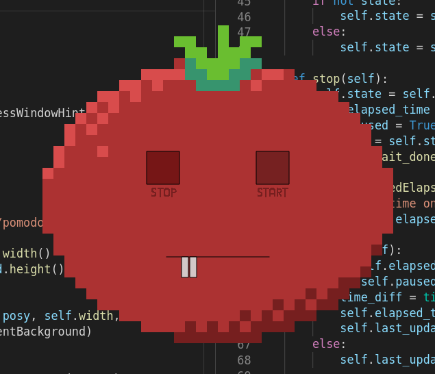

# PomodoroApp
A simple pomodoro app in PyQt5.15. Custom appearance. Classic rounds. Weird sounds (with simpleaudio). Weirder look.

- Start/Stop buttons on GUI
- click slider or
- hit [space] to pause/un-pause
- CTRL-Q to Quit

TODO:
- config menu and config file
- maybe cli parameters
